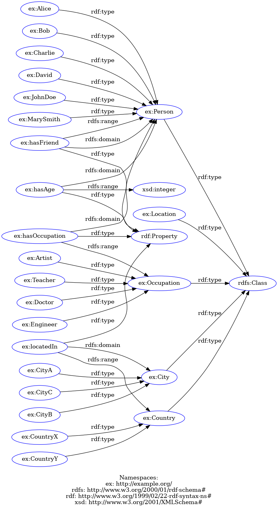

# TinyLDF - Simple Linked Data Fragment Server

## Overview

This project is a simple Linked Data Fragment (LDF) server that allows users to query and insert RDF data (quads) into the system. Below is a representation of the RDF data used in the project.

## RDF Data

Here is a table representing the quads used in the system:

| Subject            | Predicate         | Object             | Graph             |
|--------------------|-------------------|--------------------|-------------------|
| ex:Alice           | ex:hasFriend      | ex:Bob             | ex:SocialGraph    |
| ex:Bob             | ex:hasFriend      | ex:Charlie         | ex:SocialGraph    |
| ex:Charlie         | ex:hasFriend      | ex:David           | ex:SocialGraph    |
| ex:David           | ex:hasAge         | 30                 | ex:PersonGraph    |
| ex:Alice           | ex:hasAge         | 28                 | ex:PersonGraph    |
| ex:Bob             | ex:hasAge         | 35                 | ex:PersonGraph    |
| ex:Charlie         | ex:hasAge         | 40                 | ex:PersonGraph    |
| ex:David           | ex:hasOccupation  | Doctor             | ex:OccupationGraph |
| ex:Alice           | ex:hasOccupation  | Artist             | ex:OccupationGraph |
| ex:Bob             | ex:hasOccupation  | Teacher            | ex:OccupationGraph |
| ex:Charlie         | ex:hasOccupation  | Engineer           | ex:OccupationGraph |
| ex:CityA           | ex:locatedIn      | ex:CountryX        | ex:LocationGraph  |
| ex:CityB           | ex:locatedIn      | ex:CountryX        | ex:LocationGraph  |
| ex:CityC           | ex:locatedIn      | ex:CountryY        | ex:LocationGraph  |
| ex:JohnDoe         | ex:hasAge         | 25                 | ex:PersonGraph    |
| ex:MarySmith       | ex:hasOccupation  | Engineer           | ex:OccupationGraph |
| ex:CityX           | ex:locatedIn      | ex:CountryY        | ex:LocationGraph  |

## RDF Visualization

Below is a diagram illustrating the RDF structure of the data:

## Project Team

- **Mohammed OUEDRHIRI**
- **Achraf RHOULAM**
- **Anas MASROUR**

## Usage

You can interact with the server using the following features:

1. **Insert New Quads**: The application allows authenticated users to insert new quads (subject, predicate, object, graph) into the system.
2. **Query Quad Patterns**: You can query the server using specific quad patterns to retrieve RDF data.
3. **View Results**: The results of queries will be paginated, and execution time will be displayed.

### Login Credentials

Our Deployed App : https://storage.googleapis.com/tiny-ldf-fe/index.html

- **Username**: admin
- **Password**: password

